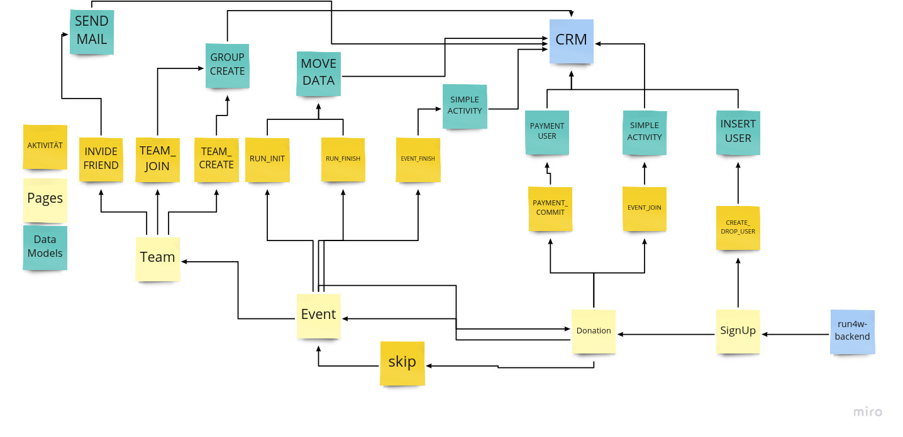

# Store data in CiviCrm

## Concept

```
  "crm_data": {
    "campaign_id": 17,
    "drops_id": "540e695b-341e-4256-8a3b-9aa874332f60",
    "activity": "SIGNUP"
  }
```


## Run4Water workflow



### SIMPLE ACTIVITY

```
  "crm_data": {
    "campaign_id": 17,
    "drops_id": "540e695b-341e-4256-8a3b-9aa874332f60",
    "activity": "EVENT_JOIN"
  }
```

### INSERT USER crm model
```
{
  "crm_data": {
    "campaign_id": 17,
    "drops_id": "540e695b-341e-4256-8a3b-9aa874332f60",
    "activity": "SIGNUP"
  },
  "crm_user": {
    "email": "dennis_kleber22@mailbox.org",
    "first_name": "dennis",
    "last_name": "kleber",
    "privacy_policy": true,
    "country": "DE"
  },
  "mail": {
    "link": "http://localhost:1323/auth/signup/confirm/MyPZF1HCqBKzCsCAfsoYiGigUbwRflzpf8Mt6NOmaTc="
  },
  "offset": {
    "known_from": "facebook",
    "newsletter": false
 }
}
```
### PAYMENT USER crm model

```
  "crm_data": {
    "campaign_id": 17,
    "drops_id": "540e695b-341e-4256-8a3b-9aa874332f60",
    "activity": "PAYMENT_COMMIT"
  },
  "payment":{
    "id":"",
    "provider":"paypal"
    "money":{
        "amount":12000,
        "currency":"EUR"
    }  
  }
```

### SEND MAIL

```
{
    "crm_data": {
        "campaign_id": 17,
        "drops_id": "540e695b-341e-4256-8a3b-9aa874332f60",
        "activity": "SIGNUP"
    },
    "mail": {
        "email": "freund@gmx.org" //dürfen wir nicht als Kontakt anlegen. Sorry für die schlechte vorarbeit im letzten Model ^^
        "link": "link_mit_token"
    }
}
```

### MOVE DATA


```
  "crm_data": {
    "campaign_id": 17,
    "drops_id": "540e695b-341e-4256-8a3b-9aa874332f60",
    "activity": "RUN_INIT / RUN_FINISH"
  },
  "move": {
    "range": 100
    "meas": "km"
    "time": 0
  }
```

### GROUP CREATE


```
  "crm_data": {
    "campaign_id": 17,
    "drops_id": "540e695b-341e-4256-8a3b-9aa874332f60",
    "activity": "MOVE_DATA"
  },
  "group_name": "teamname"
